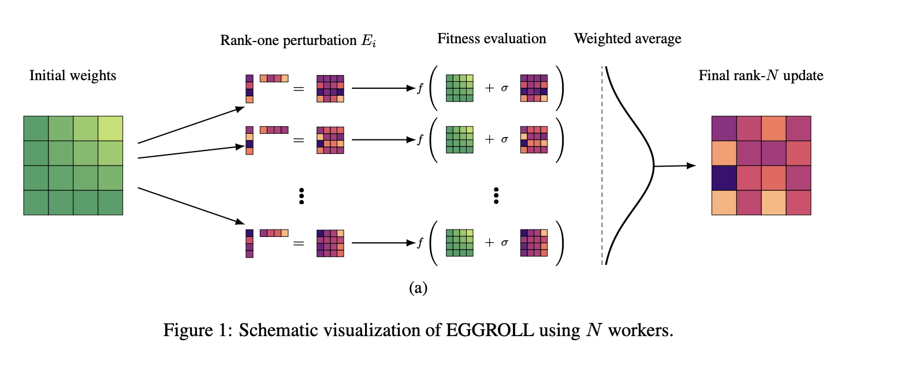
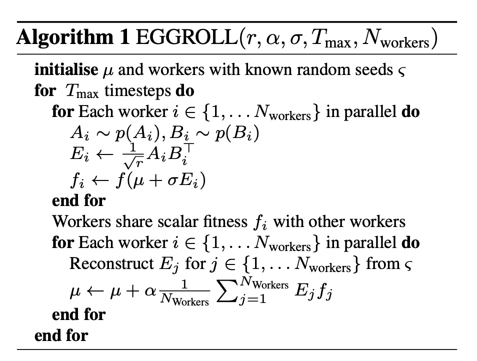

## EGGROLL MNIST

If you just wanna run the experiments, run `./run_experiments.sh`.

### Requirements:
- **uv**: You need to have `uv` installed. Installation instructions: [https://docs.astral.sh/uv/getting-started/installation/](https://docs.astral.sh/uv/getting-started/installation/)
- **GPU**: A GPU with ~500MB VRAM is sufficient.

### Overview:

There are two scripts that are run by `run_experiments.sh`: `mnist_backprop.py` and `mnist_eggroll_optimized.py`.

The first uses standard backpropagation and the latter uses backprop-free Evolution Strategies (ES) to converge on the MNIST dataset.

Both scripts use the same network architecture (3-layer MLP with 128 hidden units), same activation function (GELU), same batch size (128), same number of epochs (10). The remaining hyperparameters of both were optimized in extensive grid searches.

### Results:

Both achieve ~97.5% accuracy on the test set (97.54% backprop, ~97.4% EGGROLL). With the optimized implementation, EGGROLL uses almost the same memory (~433MB vs ~391MB) and is ~5x slower (~22s vs ~4.6s).

The interesting part is the flexibility of ES. Since ES doesn't require gradients, the fitness signal can be anything. Here I use temperature-scaled cross-entropy (T=2.0) instead of raw accuracy, which gives a smoother fitness landscape and allows cutting the population from 8,000 to 5,000 for comparable accuracy.

### Optimizations:

The optimized EGGROLL implementation (mnist_eggroll_optimized.py) includes several key improvements over the naive implementation (mnist_eggroll.py) getting it from ~4x memory compared to backprop to ~1.15x memory and from 100x wall-clock time to ~7x wall-clock time:

1. **Antithetic sampling** - evaluate +σε and -σε together; reuses first layer computations and requires half the perturbation vectors
2. **bfloat16 forward pass** - reduces memory (while experiments showed little impact on accuracy)
3. **Fused vector generation** - single call generates all layer perturbations
4. **Standardized fitness shaping** - uses mean/std normalization instead of rank-based (slight computational gain)
5. **Orthogonal initialization** - gave me slightly better accuracy results than He initialization
6. **Tuned population size and LR** - 5,000 (10,000 effective with antithetic) with balanced LR/sigma config vs 39,000 before (keeping almost same accuracy due to above optimizations)
7. **Temperature-scaled cross-entropy fitness** - using CE with T=2.0 instead of raw accuracy as the fitness signal gives smoother gradients, allowing the population reduction from 8,000 to 5,000 with almost no accuracy loss

### Background:

I implemented the main algorithm (EGGROLL) from this paper:
**"Evolution Strategies at the Hyperscale"**
*Bidipta Sarkar, Mattie Fellows, Juan Agustin Duque, et al.* (2025)
[https://arxiv.org/pdf/2511.16652](https://arxiv.org/pdf/2511.16652)

EGGROLL is a Evolution Strategies (ES) algorithm that achieves much higher efficiency than naive ES.

ES is based on random perturbations applied to the weight matrices (the number of independent perturbations is given by the "population size"). These are then used in separate rollouts in the task at hand and evaluated with a fitness score. The weight update moves the weights in the direction of the "most successful" perturbations (this is a highly simplified explanation).

The main problem with naive ES is the memory and compute inefficiency which is O(N) where N = population size.

The authors of the EGGROLL paper solved this problem to some extent by using low-rank perturbations that no longer involve materializing the full-rank matrix perturbations at any point in time. Read the paper or my code if you wanna see how exactly this is done and some neat tricks they used to make it work.

The authors of the paper used the above mentioned flexibility of ES to do INT8 native training. I also replicated that and my results were pretty bad. Obviously, the lower precision makes learning much harder. But also, the overhead of clipping and casting is quite high. I'm not too familiar with optimizing INT8 which might be part of the problem. But I'm more interested in other uses of the flexibility of ES and getting the low-rank technique super fast.

Write me an e-mail if you wanna chat about this. I'm Johann, my e-mail is johann.zahlmann@gmail.com

